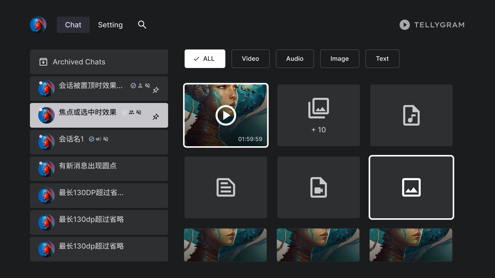

# Tellygram — Telegram for Android TV

[](https://github.com/bling0390/tellygram/releases) [](LICENSE)

An **unofficial, media-first Telegram client for Android TV**. Browse images and
video from your channels, groups and private chats on the big screen — D-pad
first, leanback UI, no phone in hand.

> Not affiliated with Telegram FZ-LLC. Built on TDLib, Telegram's own client
> library, so the app talks to Telegram directly.



*The home screen — the design frame this implementation is measured against: the
chat list on the left, the media filter chips and the media wall on the right.*

**Status:** working app, released as `v1.0.0`. Distributed as a self-built APK —
there is no Play Store listing.

## Install (nothing to compile)

Build your own signed APK with your own Telegram API credentials:

1. Create an `api_id` / `api_hash` for your account (Telegram's *API development
   tools* page).
2. Open **<https://tellygram.app/personal/>** and paste them.
3. Pick an ABI: `arm64-v8a` (~20 MB) suits most TVs, `universal` (~70 MB) if you
   are unsure.

The build runs on GitHub Actions in a few minutes and returns a **single-use
download link** (24 hours, downloads once). The APK is signed with this
project's distribution key, so later builds install straight over it.

Requires Android 5.0+ with leanback. No store account, no phone number.

## What it does

- ✅ QR-code login — no typing a phone number with a remote
- ✅ Channel / group / private chat list
- ✅ Image and video browsing inside a chat, built for a D-pad
- ✅ Video player that plays while it downloads (one contiguous window, no holes)
- ✅ Software decoder fallback for formats TV hardware refuses
- ✅ English / 简体中文 / 繁體中文, dark TV theme

Deliberately out of scope: sending messages, text-only chats, voice messages,
search, multiple accounts. This is a viewer.

## Build from source

| Tool | Version |
|---|---|
| JDK | 17 |
| Android SDK | platform 35, build-tools 34.0.0 |
| Gradle | 8.6 (wrapper) |
| AGP / Kotlin | 8.4.2 / 2.0.20 |
| UI | Compose for TV, Media3 1.7.1 |
| Telegram | TDLib — vendored Java bindings in `libtd/` |

```bash
bash scripts/install-sdk.sh            # SDK + platform-tools (one-off)

cp local.properties.example local.properties
# fill in TG_API_ID / TG_API_HASH — never commit this file

./gradlew :app:assembleDebug -Pabi=arm64-v8a
bash scripts/dev-install.sh            # install on a connected TV, tail logcat
```

`-Pabi=<abi>` builds exactly one artifact: `arm64-v8a`, `armeabi-v7a`, `x86_64`
or `universal`. Signed release builds need a key first:

```bash
bash scripts/generate-keystore.sh      # creates keystore/tellygram-release.jks
bash scripts/release-apks.sh           # signed release APKs
bash scripts/publish-apks.sh           # copy them to the file host
```

Credentials and the keystore are git-ignored; builds inject the credentials at
compile time and they never appear in the repository.

## Releasing

- The version lives in **one place**: `baseVersion` in `app/build.gradle.kts`.
  `versionCode` is derived from it (`1.0.2` → `10002`), so the two cannot drift.
- A release is a **tag**:

  ```bash
  # bump baseVersion first, commit, then:
  git tag -a v1.0.1 -m "Tellygram v1.0.1"
  git push origin v1.0.1
  ```

- The personal-APK service builds **the newest tag**, so the version the site
  shows is the version that ships; if a tag and the built version disagree, the
  workflow warns.

## Layout

```
app/       the Android TV app (Compose + Media3)
libtd/     TDLib: vendored Java bindings + native libraries per ABI
scripts/   SDK install, dev install, keystore, release, publish
docs/      architecture, build, dev workflow, release, decision log
```

The personal-APK service (the small relay behind tellygram.app) is self-hosted
and lives outside this repository.

## Documentation

- [docs/ARCHITECTURE.md](docs/ARCHITECTURE.md) — how the pieces fit together
- [docs/BUILD.md](docs/BUILD.md) — toolchain, build, troubleshooting
- [docs/DEV-WORKFLOW.md](docs/DEV-WORKFLOW.md) — the dev loop
- [docs/RELEASE.md](docs/RELEASE.md) — signing, packaging, distribution
- [docs/DECISIONS.md](docs/DECISIONS.md) — the decision log

## License

MIT — see [LICENSE](LICENSE). Bundled third-party components (TDLib, AndroidX, Media3, zxing) keep their own licences.
